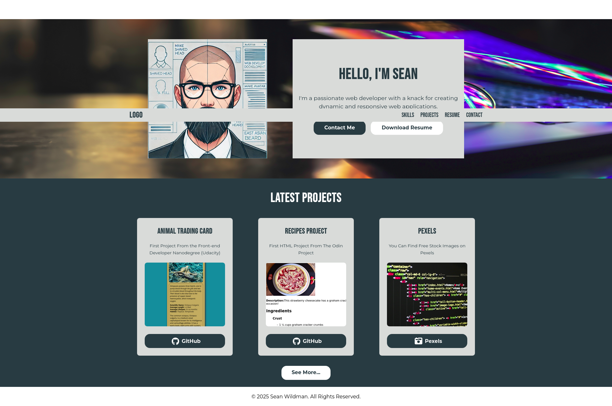

# Portfolio Homepage Project

## Overview

This project is a responsive and accessible portfolio homepage designed to showcase my skills as a Fron End Web Developer. It features an intro banner with a profile image and bio, a section for the latest projects, a navigation header, and a footer. The project emphasizes modern web development practices, including semantic HTML, SASS, and accessibility standards.

## What I Learned

Throughout the development of this project, I have gained valuable experience and knowledge in the following areas:

### 1. npm and SASS Setup
- Learned how to use npm to set up and manage SASS for compiling SCSS files into CSS.
- Gained an understanding of how to automate tasks using npm scripts.

### 2. Semantic HTML
- Developed skills in writing semantic HTML to improve the accessibility and SEO of web pages.
- Ensured that the HTML structure is meaningful and follows best practices.

### 3. SASS (Syntactically Awesome Style Sheets)
- Mastered the use of SASS to write modular and maintainable CSS.
- Learned how to use variables, mixins, and nesting to enhance the styling process.

### 4. JavaScript
- Learned how to implement a navbar that gets smaller on scroll.

### 5. Accessibility Standards
- Ensured the project meets expected A and AA accessibility standards.
- Focused on making the site usable for people with disabilities by following best practices.

### 6. CSS Media Queries
- Learned how to use CSS media queries to create a responsive design that works across different devices and screen sizes.

### 7. Structuring SASS Files and Folders
- Organized SASS files using a structured approach, including base, blocks, and utils directories.
- Followed the BEM methodology to maintain a clean and scalable codebase.

### 8. Flexbox
- Gained proficiency in using Flexbox to create flexible and responsive layouts.
- Utilized Flexbox properties to align and distribute space among items in a container efficiently.

### 9. Tabnine
- Utilized Tabnine as an AI assistant to explore and understand complex concepts.

## Conclusion

This project has been an excellent opportunity to apply and expand my web development skills. By integrating various technologies and methodologies, I have created a portfolio homepage that is not only visually appealing but also accessible and responsive. I look forward to building upon these skills in future projects.

### Screenshot

<a href="https://twelvegoats.github.io/udacity_portfolio1/" target="_blank">See on GitHub</a>
